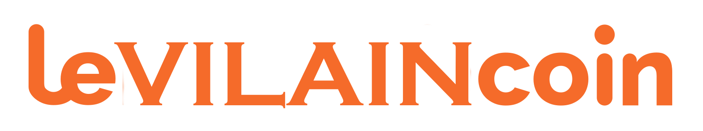

<div align='center'>
    <h1 id="top"><b>🦹 Levilaincoin 🦹</b></h1>
    
    <p>WCS PROJECT [Hackathon #2]</b></p>


</div>

 <p align="center">
    <a href="https://newaluigi.github.io/KaamelottQuests/"><strong>Explore the website »</strong></a>
    <br />
    <br />
    <a href="https://newaluigi.github.io/KaamelottQuests.svg/issues">Report Bug</a>
    ·
    <a href="https://newaluigi.github.io/KaamelottQuests.svg/issues">Request Feature</a>
  </p>
</div>

<details>
  <summary>Table of Contents</summary>
  <ul>
    <li><a href="#-about-the-project">About The Project</a></li>
    <li><a href="#-technologies">Technologies</a></li>
    <li><a href="#%EF%B8%8F-mock-up">Mock-up</a></li>
    <li><a href="#-installation">Installation</a></li>
    <li><a href="#-showcase">Showcase</a></li>
    <li><a href="#-ressources">Ressources</a></li>
    <li><a href="#-go-further">Go further</a></li>
    <li><a href="#-license">License</a></li>
    <li><a href="#%EF%B8%8F-contact">Contact</a></li>
  </ul>
</details>

---

## 🐔 **ABOUT THE PROJECT**

24 hours in team to discover how to create a site with a little back-end.The topic was to bring a modern service to an history era. We chose the medieval times, and our site had the goal to bring a new digital tool to the knights of the round table (in Kaamelott's universe), in order that they can find more efficiently their quests without having to go to the tavern first...
<br />
<br />
For this project we create a little database and a begining of a CRUD.

<br />

<p align="right">(<a href="#top">back to top</a>)</p>

---

## 💻 **TECHNOLOGIES**

* Languages : 

* Style : 

* Framework Front : 

* Framework Back :  

* Database : 

* Design : 

* Organization : 

* Remote team work :   

* IDE : 

<br />

<p align="right">(<a href="#top">back to top</a>)</p>

---

## ✏️ **MOCK-UP**

### Figma

<br />


### Color Reference

| Color             | Hex                                                                |
| ----------------- | ------------------------------------------------------------------ |
| main-color |  #64172A |
| secondary-color |  #ffffff |


<br />

### Font Reference

| Font             | Ref                                                                |
| ----------------- | ------------------------------------------------------------------ |
| main-font | **Eagle Lake** |

<br />

<p align="right">(<a href="#top">back to top</a>)</p>

---

## 💾 **INSTALLATION**

### Local installation:

1. clone the repo

```
git clone https://github.com/Newaluigi/KaamelottQuests.git
```

2. cd into cloned repo

```
cd repo
```

3. install dependencies

```
npm install
```

### Launch Back-end

4. cd into cloned repoBACK

```
cd repoBACK
```

5. install dependencies

```
node index.js
```

### Getting Started with Create React App :

This project was bootstrapped with [Create React App](https://github.com/facebook/create-react-app).

#### Available Scripts

In the project directory, you can run:

##### `npm start`

Runs the app in the development mode.\
Open [http://localhost:3000](http://localhost:3000) to view it in your browser.

The page will reload when you make changes.\
You may also see any lint errors in the console.

##### `npm test`

Launches the test runner in the interactive watch mode.\
See the section about [running tests](https://facebook.github.io/create-react-app/docs/running-tests) for more information.

##### `npm run build`

Builds the app for production to the `build` folder.\
It correctly bundles React in production mode and optimizes the build for the best performance.

The build is minified and the filenames include the hashes.\
Your app is ready to be deployed!

See the section about [deployment](https://facebook.github.io/create-react-app/docs/deployment) for more information.

##### `npm run eject`

**Note: this is a one-way operation. Once you `eject`, you can't go back!**

If you aren't satisfied with the build tool and configuration choices, you can `eject` at any time. This command will remove the single build dependency from your project.

Instead, it will copy all the configuration files and the transitive dependencies (webpack, Babel, ESLint, etc) right into your project so you have full control over them. All of the commands except `eject` will still work, but they will point to the copied scripts so you can tweak them. At this point you're on your own.

You don't have to ever use `eject`. The curated feature set is suitable for small and middle deployments, and you shouldn't feel obligated to use this feature. However we understand that this tool wouldn't be useful if you couldn't customize it when you are ready for it.

#### Learn More

You can learn more in the [Create React App documentation](https://facebook.github.io/create-react-app/docs/getting-started).

To learn React, check out the [React documentation](https://reactjs.org/).

##### Code Splitting

This section has moved here: [https://facebook.github.io/create-react-app/docs/code-splitting](https://facebook.github.io/create-react-app/docs/code-splitting)

##### Analyzing the Bundle Size

This section has moved here: [https://facebook.github.io/create-react-app/docs/analyzing-the-bundle-size](https://facebook.github.io/create-react-app/docs/analyzing-the-bundle-size)

##### Making a Progressive Web App

This section has moved here: [https://facebook.github.io/create-react-app/docs/making-a-progressive-web-app](https://facebook.github.io/create-react-app/docs/making-a-progressive-web-app)

##### Advanced Configuration

This section has moved here: [https://facebook.github.io/create-react-app/docs/advanced-configuration](https://facebook.github.io/create-react-app/docs/advanced-configuration)

##### Deployment

This section has moved here: [https://facebook.github.io/create-react-app/docs/deployment](https://facebook.github.io/create-react-app/docs/deployment)

##### `npm run build` fails to minify

This section has moved here: [https://facebook.github.io/create-react-app/docs/troubleshooting#npm-run-build-fails-to-minify](https://facebook.github.io/create-react-app/docs/troubleshooting#npm-run-build-fails-to-minify)

<p align="right">(<a href="#top">back to top</a>)</p>

---

## 🔎 **SHOWCASE**

### Key features
* Connexion page
* Homepage with animation
* Database with 2 tables
* Display of data on 2 front pages : Knights and Quests
* Modal for further informations of data elements


<br />

### Details

<br />

#### Homepage
You begin the experience with a login page.
<br />
<br />
<p align="center"> 

</p>
On the homepage you have a little animation of Excalibur and the navbar present on every page as well on the right side with the logo of the Kaamelott TV show
<br />
<br />
<p align="center"> 

</p>
<p align="center"> 

</p>
<br />
<p align="center"> 

</p>

#### Knights page
Here we have all the knights of the database, and we can open a new page with more details for each of them
<br />
<br />
<p align="center"> 

</p>    
<br />
<p align="center"> 

</p>

#### Quests page
Here we have all the quests of the database, and we can open a modal with more details for each of them
<br />
<br />
<p align="center"> 

</p>
<br />
<p align="center"> 

</p>
<br />
<p align="center"> 

</p>
<br />
<p align="center"> 

</p>

#### Contact & Team
At the end of the navbar there are two bonus page : the presentation of the knights of the SQL table with a little animation that reveal the social links of each and the contact page with a little cool sound effect
<br />
<p align="center"> 

</p>
<br />
<p align="center"> 

</p>
<br />
<p align="center"> 

</p>


<p align="right">(<a href="#top">back to top</a>)</p>

---

## 📚 **RESSOURCES**

### Data base


### Back
* CRUD integration
* Connexion

### Modal


### CSS Tips
* Lateral navbar :
* Object animation :
* Glassmorphism :

<br />

<p align="right">(<a href="#top">back to top</a>)</p>

---

## 🔨 **GO FURTHER**

* Bug user connexion
* Improve knight details css
* Contact form effective
* Add Post method
* Add one picture for each quest or a more generic logo
* Add a possibility to attibute one quest to a knight
* Add more sound effects like the generic music

<br />

<p align="right">(<a href="#top">back to top</a>)</p>

---

## 📜 **LICENSE**

No specific licence

<br />

<p align="right">(<a href="#top">back to top</a>)</p>

---

## ✉️ **CONTACT**

[](https://github.com/Newaluigi/)

<br />
<p align="right">(<a href="#top">back to top</a>)</p>
